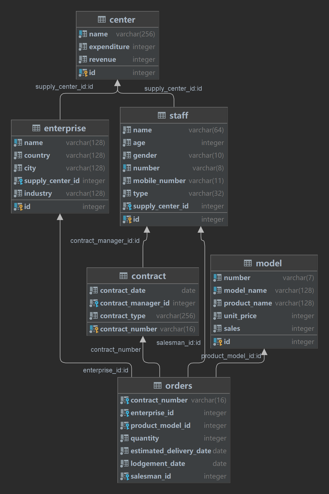
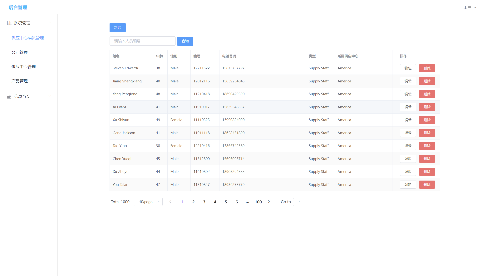
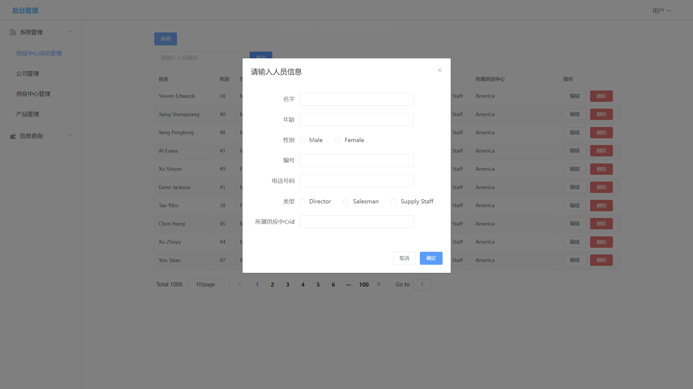
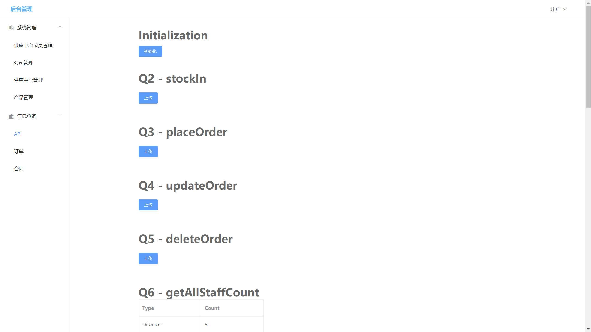

<center><font size='8'><b>CS307 Project 2 - Report</b></font></center>

> Group Members:
>
> ​	张闻城(12010324)
>
> ​	谢宇东()

<font size='6'><b>目录</b></font>

[TOC]


# **1. Database Design**



## 1.1 `center`

`center` table has two original property: `id`, `name.`

We add expenditure and revenue to update the pay and the profit of each center when we import `task1_in_stoke_test_data_publish.csv`,  `task2_test_data_publish.csv`, `task34_update_test_data_publish.tsv`, `task34_delete_test_data_publish.tsv`.

## 1.2 `enterprise`

`enterprise` table has 6 original property: `id`, `name`, `country`, `city`, `supply_center`, `industry`. We use foreign key to connect it with `center`:

```postgresql
constraint enterprise_supply_center_fk foreign key (supply_center_id) references center (id) on delete cascade
```

## 1.3 `model`

`model` table has 5 original property: `id`, `number`, `model_name`, `product_name`, `unit_price`

We add sales to update the number of sales model of each model when we import `task1_in_stoke_test_data_publish.csv`, `task2_test_data_publish.csv`, `task34_update_test_data_publish.tsv`, `task34_delete_test_data_publish.tsv`.

## 1.4 `staff`

`staff` table has 5 original property:  `id`,` name`, `age`, `gender`, `number`, `mobile_number`, `type`, `supply_center`. We use foreign key to connect it with `center`.

```postgresql
constraint center_staff_fk foreign key (supply_center_id) references center (id) on delete cascade
```

## 1.5 `contract`

`contract` table is a new table and used to record the information of contract in `task2_test_data_publish.csv`. We use foreign key to connect it with `staff`

```postgresql
constraint contract_staff_fk foreign key (contract_manager_id) references staff (id) on delete cascade
```

## 1.6 `inventory`

`inventory` table is a new table and used to record the information of stock in `task1_in_stoke_test_data_publish.csv`, and update it in `task2_test_data_publish.csv`, `task34_update_test_data_publish.tsv`, `task34_delete_test_data_publish.tsv`. We use foreign key to connect it with `model` and `center`

```postgresql
constraint stock_center_fk foreign key (supply_center_id) references center (id) on delete cascade
constraint stock_model_fk foreign key (product_model_id) references model (id) on delete cascade
```

## 1.7 `center_record`

`center_record` table is a new table and used to record the information of stock in `task1_in_stoke_test_data_publish.csv`. We use foreign key to connect it with `model`, `center` and `staff`

## 1.8 `orders`

`orders` table is a new table and used to record the information of each order in `task1_in_stoke_test_data_publish.csv`, and update it in `task2_test_data_publish.csv`, `task34_update_test_data_publish.tsv`, `task34_delete_test_data_publish.tsv`. We use foreign key to connect it with `model`, `center`, `staff` and `contract`.

```postgresql
constraint orders_product_model_fk foreign key (product_model_id) references model (id) on delete cascade,
constraint orders_salesman_fk foreign key (salesman_id) references staff (id) on delete cascade,
constraint orders_enterprise_fk foreign key (enterprise_id) references enterprise (id) on delete cascade,
constraint orders_contract_fk foreign key (contract_number) references contract (contract_number) on delete cascad
```

# **2. API Design**

## 2.1 stockIn
According to `task1_in_stoke_test_data_publish.csv`, put the information into `inventory` table and `record` table.
And we should notice that:
(1) select the center of the salesman and it must be same as the information of the staff table
(2) select the type of the staff and it must be salesman
(3) select the information of center, staff and product to make sure they exist

## 2.2 placeOrder
According to `task2_test_data_publish.csv`, put the information into `orders` table and `contract` table.
And we should notice that:
(1) select the inventory of the model and compare it with the quantity in the order, we should make sure inventory is more than quantity
(2) select the type of salesman to check it whether is salesman in staff table
(3) update the quantity in inventory and sales in model table

## 2.3 updateOrder
According to task34_update_test_data_publish.tsv, put the information into `orders` table and `inventory` table
And we should notice that:
(1) select the staff in order to check whether it is the same person
(2) update the quantity in inventory and sales in model table
(3) check the updated quantity whether is 0

## 2.4 deleteOrder
According to task34_delete_test_data_publish.tsv, put the information into `orders` table and `inventory` table
And we should notice that:
(1) select the staff in order to check whether it is the same person
(2) update the quantity in inventory and sales in model table
(3) make sure contract table does not delete contract

## 2.5 getAllStaffCount
Use simple **SQL** language to get it.
```xml
<select id="getAllStaffCount" resultMap="staffTypeToStaffCntMap">
        select type as type, count(*) as count
        from staff
        group by type
</select>
```
## 2.6 getContractCount
Use simple **SQL** language to get it.
```xml
<select id="getContractCount" resultMap="contractCountMap">
        select count(*) as count from contract
</select>
```
## 2.7 getOrderCount
Use simple **SQL** language to get it.
```xml
<select id="getOrderCount" resultMap="orderCountMap">
  select count(*) as count from orders
</select>
```

## 2.8 getNeverSoldProductCount
Find the model which sales is 0 then count the number of them.
```xml
<select id="getNeverSoldProductCount" resultMap="neverSoldProductCountMap">
        select count(*) as count
        from (select model.model_name
              from model
                       join center_record cr on model.id = cr.product_model_id
              where model.sales = 0
                and cr.quantity != 0
              group by model.model_name) as sub
</select>
```

## 2.9 getFavoriteProductModel
Find the model which has the highest sales, first count number of each product, then select the max.
```xml
<select id="getFavoriteProductModel" resultMap="favoriteProductModelMap">
    select model_name, sales
    from model
    where sales = (select max(sales) from model)
</select>
```

## 2.10 getAvgStockByCenter
Count the number of products for each center and then divide the types of model. Notice that we should round the result and divide the types which number more than 0
```xml
<select id="getAvgStockByCenter" resultMap="avgStockInByCenterMap">
        select c.name as centerName, round(sum(count) / count(product_model_id)::numeric, 1) as avg
        from inventory
                 join center c on c.id = inventory.supply_center_id
        group by c.name
        order by c.name
</select>
```

## 2.11 getProductByNumber
Input the number of product and then select the relevant information by it. We should count number for each center
```xml
<select id="getProductByNumber" resultMap="productByNumberMap">
        select center.name as centerName, m.model_name as modelName, i.count as count
        from center
                 join inventory i on center.id = i.supply_center_id
                 join model m on m.id = i.product_model_id
        where product_name = #{productName}
        group by center.name, m.product_name, m.model_name, i.count
</select>
```

## 2.12 getContractInfo
Input yhe number of contract, and select in contract table and orders table to get the information. If there is no orders in contract, we should still show the information of the contract
```xml
<select id="getContractInfo" resultMap="contractInfoMap">
        select distinct c2.contract_number as contract_number,s2.name as staffName,e.name as enterpriseName ,c.name as centerName
        from orders
                 join model m on m.id = orders.product_model_id
                 join enterprise e on e.id = orders.enterprise_id
                 join center c on c.id = e.supply_center_id
                 join staff s on s.id = orders.salesman_id
                 join contract c2 on orders.contract_number = c2.contract_number
                 join staff s2 on s2.id=c2.contract_manager_id
        where c2.contract_number = #{contract_number}
</select>

```
```xml
<select id="getOrderInfo" resultMap="orderInfoMap">
        select distinct m.model_name as modelName,s.name as salesmanName,quantity,unit_price as unitPrice,estimated_delivery_date,lodgement_date
        from orders
                 join model m on m.id = orders.product_model_id
                 join enterprise e on e.id = orders.enterprise_id
                 join center c on c.id = e.supply_center_id
                 join staff s on s.id = orders.salesman_id
                 join contract c2 on orders.contract_number = c2.contract_number
                 join staff s2 on s2.id=c2.contract_manager_id
        where c2.contract_number = #{contract_number}
</select>
```
# **3. Advanced Part**

## 3.1 Enhanced Usability of API


## 3.2 Design Pattern

**DAO (Data Access Objects)** is applied into this project to implment enable access to persistent data between business logic and persistent data and wrap all database operations. This design pattern mainly divides the **Java** classes into the following layers:

- `entity`: Used to store and transfer object data.
- `service`: Define all operations on the database as abstract methods, which can provide multiple implementations.
- `impl`: Give a concrete implementation of the **service** interface definition method for different databases.

Besides, since we use **Mybatis-Plus** to implement manipulate and operate **CRUD** of the database in **Java**, and communication and interaction between front and back-end, another layers will be added:

- `mapper`: Composed of **Java** interfaces and **XML** files. It has functions of:
  1. Define the parameter type
  2. Configuration Cache
  3. Provide SQL statements and dynamic SQL
  4. Define the mapping relationship between query results and **POJO**
- `controller`: Responsible for front-end and back-end interaction, accepting front-end requests, calling the service layer, receiving data returned from the service layer, and finally returning the specific page and data to the client.

## 3.3 HTTP/RESTful Web Services

In this project, we use [**Springboot**]([Spring Boot](https://spring.io/projects/spring-boot)) to encapsulate and implement the backend API. To implement request back-end data and operations through web services, all we need is to add anotations in `controller` layer:

- `@RestController`: provide **Restful** style interface return values, or **json** objects.
- `@GetMapping`: Handle **get** requests, which correspond to `select` operation in the database.
- `@PostMapping`: Handle **post** requests (usually to add data), which correspond to `insert` operation in database.
- `@PutMapping`: Handle **post** requests (usually to modify data), which corrsepond to `update` operation in database.
- `@DeleteMapping`: Delete URL mapping, which corrsepond to `delete` operation in database.
- `@RequestParam`: Specify the Request parameter in the HTTP protocol.
- `@RequestBody`: Used to receive data in a **json** string passed from the front-end to the back-end

## 3.4 Frontend Design

In this project, we also implement the front and back-end separation.  We mainly use **[vue](https://github.com/vuejs/core)** and **[element-plus](https://github.com/element-plus/element-plus)** to build the user interface (web page).


<center>Figure 1. Login page</center>

User need to enter his or her username and password to login the system.



<center>Figure 2. Basic web page</center>

The data are mainly demonstrated by the form of table. To make the interface moew beautiful, we implement the pagination function of tables by using the **Pagination InnerInterceptor** of **Mybatis-Plus**. For the basic four information tables (`staff`, `center`, `enterprise`, `product`), user can execute **CRUD** operations in web page. 



<center>Figure 3. Insert data example</center>

To simplify the operations of user, we add the `Initialization` button to intialize the four baisc tables at one single button. Besides, user can upload the testcase files directly in frontend page.



## 3.5 Database Connection Pool

In this project, we use connection pool [HikaiCP](https://github.com/brettwooldridge/HikariCP), which is the default connection pool appiled by **SpringBoot**. Below is some configuration of our connection pool.

```yaml
spring:
    type: com.zaxxer.hikari.HikariDataSource
    hikari:
      maximum-pool-size: 16
      auto-commit: false
```

## 3.6 Manipulation to Database

In this project, we use **[Mybatis-Plus](https://github.com/baomidou/mybatis-plus)** to implement manipulate the database using **Java**, since it can simplify development.

**Mybatis-Plus** use the form of **XML** or **Annotation** to customize the **SQL** statement. Besides, it can automatically encapsulate the selected data into **Java** objects, such as `List`, `Map` or just the corresponding `entity` classes. **Mybatis-Plus** also some **Java** methods to implement the simple **CRUD** operations so that you do not need to write **SQL** again.

```java
@Mapper
public interface CenterMapper extends BaseMapper<Center> {
    @Update("update center set expenditure = expenditure + #{expenditure} where id = #{id}")
    void updateExpenditure(@Param("expenditure") int expenditure, @Param("id") int id);
    
    @Select("select * from center where name = #{name}")
    Center selectByName(@Param("name") String name);
}
```

For the first function above, it use annotation `@Update` to define **update** operation, and use annotation `@Param` to define the parameters in **SQL** statement. For the **select** operation whose format is like `select * from ...` to a centain table, **Mybatis-Plus** will automatically encapsulate the data into corresponding `entity` class according to the column name.

For the complex query to a certain table that you just need certain columns of query result instead of all columns of the table, the return value need to by `java.util.Map`. Each `Map` object corresponds to one row of query results, and **key** of `Map` is the column name of results, and the **value** is the column value of corresponding column name.

```xml
<resultMap id="listPageMap" type="java.util.Map">
        <result property="staffName" column="staffName" javaType="java.lang.String"/>
        <result property="age" column="age" javaType="java.lang.Integer"/>
        <result property="gender" column="gender" javaType="java.lang.String"/>
        <result property="number" column="number" javaType="java.lang.String"/>
        <result property="mobileNumber" column="mobileNumber" javaType="java.lang.String"/>
        <result property="type" column="type" javaType="java.lang.String"/>
        <result property="supplyCenterName" column="supplyCenterName" javaType="java.lang.String"/>
</resultMap>

<select id="listPage" resultMap="listPageMap">
    select staff.name    as staffName,
    age,
    gender,
    number,
    mobile_number as mobileNumber,
    type,
    c.name        as supplyCenterName
    from staff
    join center c on c.id = staff.supply_center_id
</select>
```

